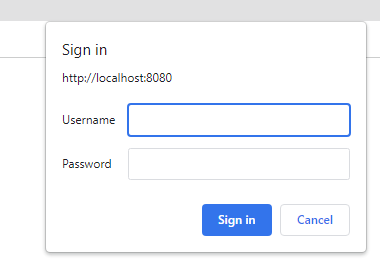
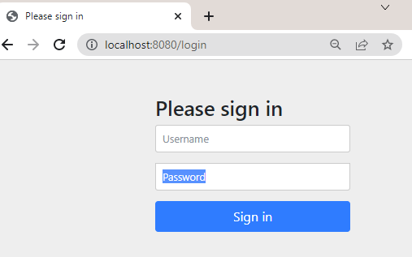
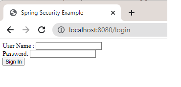

# Spring Security Example
Example of using spring security to add user/password to control access.

This is a simple Spring MVC app with Spring Security to control parts of the app with roles.

I started with this Spring Guide: https://spring.io/guides/gs/securing-web/, then added more ways to login and set up users.

To run, run the app location then point browser to: localhost:8080

As you can see in the MVCController, besides the home page, I set up some simple pages: a page that needs login (/hello). The custom login page (/login) and a manager only (/manageronly) page (where a user role needs to be "MANAGER")

In this sample app, I set up different configuration for Basic Auth, default login form, custom login form. 
Configurations are set in this method, in a file that has @Configuration and @EnableWebSecurity

<code>@Bean
    public SecurityFilterChain securityFilterChain(HttpSecurity http)</code>	

    
In this sample app I have provided several ways to specify what users and passwords to secure web pages.

But only one way can be used at a time, to use one, make sure @Configuration is @EnableWebSecurity is on (and other ways are commented)

<b>Basic Auth</b>

<b>Default login form</b>

<b>Custom login form</b>

Users/Passwords can come from many ways. For Basic Auth, where you just want a simple user/password, it may be done in application.properties file. Or they can be hardcoded with InMemoryUserDetailsManager (not recommended for production as user/password found in code). Or with in encrypted passwords, or come from a database.
